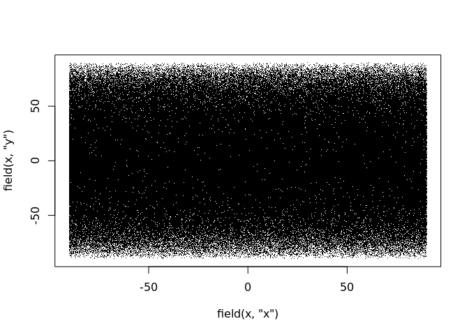

<!-- README.md is generated from README.Rmd. Please edit that file -->

# coordinates

The goal of coordinates is to provide a simple basis for storing
coordinates. At its simplest this is two vectors of x and y data but
should always include a *coordinate reference system* (i.e. a map
projection) to enable transformations.

## Installation

You can install the development version of coordinates from
[Github](https://github.com/mdsumner/coordinates) with:

``` r
remotes::install_github("mdsumner/coordinates")
```

## Motivation

In R there are many formal and informal methods for storing coordinates.
The informal ones tend to be efficient and fast. There’s no efficient
way to store raw coordinates in a data frame with reference system
metadata: the closest was sp’s `SpatialPointsDataFrame` but that only
worked by pretending to be a data frame. The tidyverse still has no
coordinates data frame mechanism.

There are so many uses for spatial data in various contexts but the
formal data structures that provide containers are limited to *regular
rasters* and *simple features* both of which ignore many common spatial
data structures and forms. A set of spatial data in a table is such a
simple and basic need, and coordinates aims to fill some of the gap.

``` r
n <- 1e6
data <- list(x = rnorm(n), y = runif(n))
system.time(plot(data, pch = "."))
```


    #>    user  system elapsed 
    #>   1.154   0.068   1.221
    
    data1 <- cbind(x = data$x, y = data$y)
    system.time(plot(data1, pch = "."))


    #>    user  system elapsed 
    #>   1.261   0.056   1.317
    
    data2 <- as.data.frame(data1)
    system.time(plot(data2, pch = "."))
    #>    user  system elapsed 
    #>   1.235   0.052   1.287
    
    data2.1 <- data2
    data2.1$a <- seq_len(nrow(data2.1))
    library(sf)
    #> Linking to GEOS 3.6.2, GDAL 2.3.3, PROJ 4.9.3


``` r

data3 <- sf::st_as_sf(data2, coords = c("x", "y"))
## don't try this it's exceptionally slow
##data3 <- sf::st_sf(geometry = sf::st_sfc(lapply(split(t(data1), rep(seq_len(nrow(data1)), each = 2)), function(x) sf::st_point(x))))

## it's no surprise that the split-list method of sf POINT is extremely slow
system.time(plot(st_geometry(data3), pch = ".", asp = ""))
```


    #>    user  system elapsed 
    #>   8.557   0.464   9.021
    
    
    library(ggplot2)
    system.time(print(ggplot(data2, aes(x, y)) + geom_point(pch = ".")))


    #>    user  system elapsed 
    #>   6.564   0.178   6.744
    
    ## this is so slow, it's pointless to use geom_sf at all for such simple data
    #system.time(print(ggplot(data3) + geom_sf(pch = ".")))  ## Timing stopped at: 192.5 2.206 194.7

## Example

This is a basic example which shows the creation and reprojection of a
set of coordinates. It’s efficient because the storage is vector-based
(x and y are each contiguous chunks of memory, not split across a list
of vectors of matrices).

``` r
library(geosphere)
library(coordinates)
x <- coordinates(randomCoordinates(1e6), crs = "+proj=longlat +datum=WGS84")
system.time(plot(x, pch = "."))
```


    #>    user  system elapsed 
    #>   1.206   0.000   1.207

By using the advanced techniques of vctrs we have defined behaviour to
bind x and y together in a single column, along with persistent metadata
(the coordinate reference system). Using the lightweight transformation
engine of reproj we can transform the object arbitrarily with very
simple code, and we can reproject again and again.

``` r
system.time(plot(x1 <- reproj(x, "+proj=laea +datum=WGS84"), pch = "."))
```


    #>    user  system elapsed 
    #>     1.6     0.0     1.6
    
    system.time(plot(x2 <- reproj(x1, "+proj=ortho +datum=WGS84"), pch = "."))


    #>    user  system elapsed 
    #>   1.469   0.000   1.469
    
    system.time(plot(x3 <- reproj(x2, "+proj=merc +datum=WGS84"), pch = "."))


    #>    user  system elapsed 
    #>   1.037   0.000   1.038
    
    vicgrid <- "+proj=lcc +lat_1=-36 +lat_2=-38 +lat_0=-37 +lon_0=145 +x_0=2500000 +y_0=2500000 +ellps=GRS80 +towgs84=0,0,0,0,0,0,0 +units=m +no_defs"
    
    ## when things are a bit funny or out of place we don't get berated or scorned
    ## we simply get what we asked for
    system.time(plot(x4 <- reproj(x3, vicgrid), pch = ".", 
                     xlim = c(-1e7, 1e7), ylim = c(-1e7, 1e7)))


    #>    user  system elapsed 
    #>   1.304   0.000   1.305
    
    
    system.time(plot(x5 <- reproj(x4, "+proj=longlat +datum=WGS84"), pch = "."))



    #>    user  system elapsed 
    #>   1.396   0.000   1.397

Technically it’s not possible to round-trip from any projection to
another, we have carefully chosen a round-trippable set of coordinate
systems here.

## Development

There’s more to do\! The package
[reproj](https://github.com/hypertidy/reproj/) and coordinates will
develop together as they are closely related.

  - currently we include sp and raster example methods, but they need to
    go
  - reproj needs a modern interface to PROJ
  - the vctrs mechanism is only partially implemented here
  - PROJ strings are only partially practical (“+init=epsg:code” form is
    not supported on CRAN for instance)
  - warn on data loss (e.g. UTM, or merc out of bounds, …)
  - flesh out use of coordinates by other packages, e.g. silicate
  - consider 3-space coordinates (complicated by lack of formal clarity
    regarding implicit z = 0, angular coordinates in radians, geocentric
    systems, planar systems and how we tend to mix units)

## Getting help

If you encounter a clear bug, please file a minimal reproducible example
on [github](https://github.com/mdsumner/coordinates/issues). For
questions and other discussion, please use
[community.rstudio.com](https://community.rstudio.com/), or twitter.

-----

Please note that the ‘coordinates’ project is released with a
[Contributor Code of Conduct](CODE_OF_CONDUCT.md). By contributing to
this project, you agree to abide by its terms.
